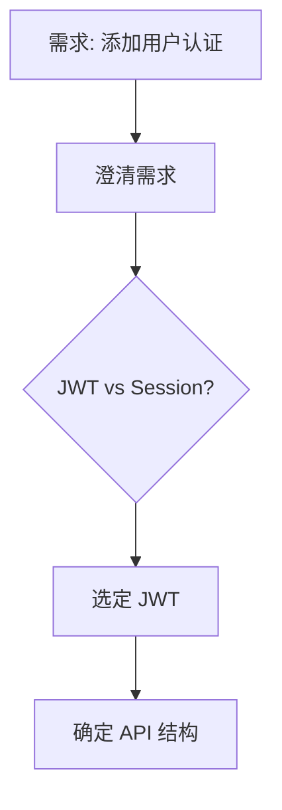

# Claude Code Superpowers 完全指南

## 前言

在 AI 编程助手日益普及的今天，如何让 AI 更高效地协助开发成为关键问题。Claude Code 的 **Superpowers** 系统正是为此而生——它通过一套结构化的技能（Skills）和自动化工作流，让 AI 编程从"聊天辅助"升级为"智能协作者"。

本文将详细介绍什么是 Superpowers，以及如何利用它们提升开发效率。

## 什么是 Superpowers？

Superpowers 是 Claude Code 中的一组**增强型技能系统**。每个 Superpower 都是一个专门化的指令集，当被激活时，会引导 Claude 以特定的、经过验证的方式处理任务。

核心特征：

- **结构化**：每个技能都有明确的流程和检查点
- **可组合**：多个技能可以串联使用，形成完整工作流
- **自动化**：减少手动重复操作，让 AI 自主执行多步骤任务

## 核心技能解析

### 1. 头脑风暴（Brainstorming）

在开始任何创意工作之前，Brainstorming 技能会被激活。它的作用是：

- 探索用户真实需求
- 澄清模糊需求
- 在设计之前统一思路

**使用场景：** 创建新功能、设计新组件、架构决策前。

### 2. 并行代理调度（Dispatching Parallel Agents）

将独立的任务分解给多个 AI 代理同时处理，大幅缩短执行时间：

```
复杂任务 → 任务分解 → 代理 A → 结果合并
                     → 代理 B → 
                     → 代理 C →
```

**使用场景：** 需要同时处理多个独立模块时。

### 3. 测试驱动开发（TDD）

遵循"红-绿-重构"的经典 TDD 循环：

1. 编写测试（红）
2. 实现功能通过测试（绿）
3. 重构优化代码

**使用场景：** 需要高可靠性的核心模块开发。

### 4. 系统性调试（Systematic Debugging）

遇到 Bug 时的结构化处理流程：

- 复现问题 → 定位根因 → 提出修复方案 → 验证修复 → 编写回归测试

**使用场景：** 任何 Bug 修复。

### 5. 代码审查（Code Review）

自动化代码审查，从多个维度检查代码质量：

- **正确性**：是否存在逻辑错误
- **安全性**：是否存在安全漏洞
- **性能**：是否存在性能瓶颈
- **可维护性**：代码是否清晰易读

**使用场景：** 提交 PR 前、代码合并前。

## 实战：一个完整工作流示例

以"为项目添加用户认证功能"为例，展示 Superpowers 的串联使用：

### 阶段 1：头脑风暴



通过 Brainstorming 技能，明确使用 JWT 认证、Session 存储用户状态。

### 阶段 2：规划与实现

进入实现阶段，利用 Plan 技能制定详细步骤：

1. 安装依赖库
2. 编写认证中间件
3. 实现登录/注册 API
4. 编写前端登录页面
5. 集成测试

### 阶段 3：测试驱动

对核心认证逻辑实施 TDD：

```javascript
// 先写测试
describe('Auth Middleware', () => {
  it('should reject requests without token', async () => {
    const res = await request(app).get('/api/protected')
    expect(res.status).toBe(401)
  })
  
  it('should accept valid token', async () => {
    const token = generateToken({ userId: 1 })
    const res = await request(app)
      .get('/api/protected')
      .set('Authorization', `Bearer ${token}`)
    expect(res.status).toBe(200)
  })
})
```

### 阶段 4：代码审查

完成实现后，自动触发 Code Review 技能检查：

> **审查结果：**
> - ✅ 密码使用 bcrypt 加密，符合安全规范
> - ✅ Token 有过期机制
> - ⚠️ 缺少刷新 Token 的 API
> - ℹ️ 建议添加登录失败次数限制

### 阶段 5：验证

使用 Verify 技能确认功能按预期工作：

- 启动开发服务器
- 执行 API 请求验证
- 检查响应是否符合预期
- 确认错误处理正常

## 最佳实践

### 1. 善用技能组合

不要孤立使用单个技能，尝试组合它们：

```
Brainstorming → Plan → TDD → Code Review → Verify
```

### 2. 提前激活相关技能

在执行任务前，主动告知 Claude 需要使用的技能，它能更好地规划执行路径。

### 3. 自定义工作流

根据团队需求定制技能流程。例如：

- **快速原型阶段**：跳过 TDD，使用 Brainstorming → Implement → Verify
- **生产发布前**：严格执行 Plan → TDD → Code Review → Security Review

## 进阶技巧

### 使用 Parallel Agents 加速

对于大型重构任务，可以将多个模块分配给不同代理并行处理：

```bash
# 示意命令
/clan parallel "重构用户模块" "重构订单模块" "重构支付模块"
```

### 利用 Worktree 隔离

在处理多个特性时，使用 Git Worktree 创建隔离的工作环境：

```bash
git worktree add ../feature-auth feature/auth
git worktree add ../feature-payment feature/payment
```

每个工作区可以独立进行开发、测试，互不干扰。

## 总结

Superpowers 系统将 AI 编程从被动的"问答模式"升级为主动的"协作模式"。通过结构化的技能和工作流，开发者可以：

1. ✅ 减少重复劳动
2. ✅ 提高代码质量
3. ✅ 加速开发流程
4. ✅ 确保代码一致性
5. ✅ 降低人为失误

无论你是个人开发者还是团队成员，掌握 Superpowers 都能显著提升你的 AI 编程体验。

---

*本文由小陈编写*
